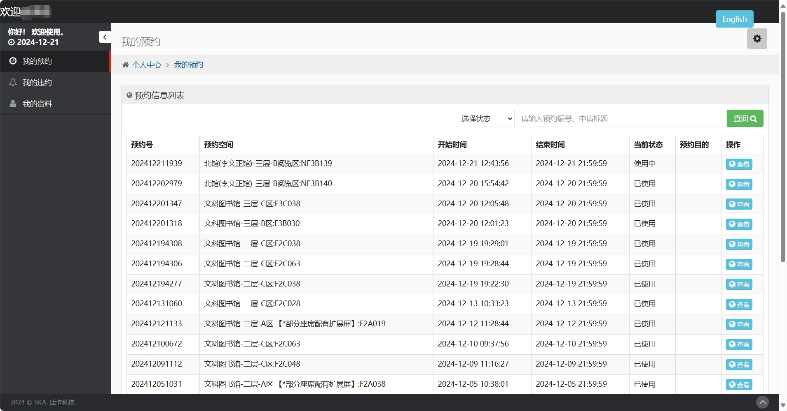
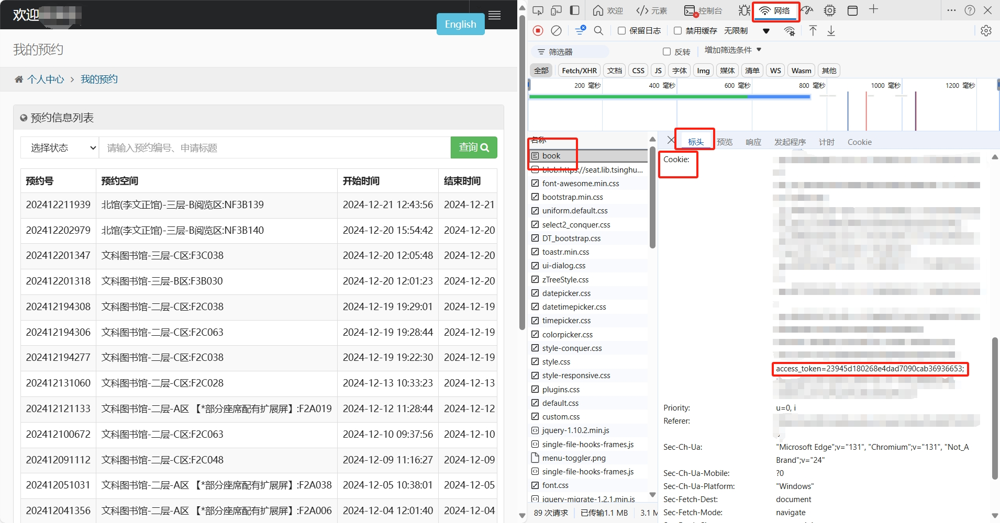

# THU-Annual-Lib

一年过去了，你在华子的图书馆自习过多少次？

## 项目简介

本项目是一个用于统计华清大学学生在图书馆的自习情况的脚本。通过模拟登录华清大学图书馆空间管理系统，获取学生在华清大学的各个图书馆的预约记录，并通过数据可视化的方式展示。


## 使用方法

### 0. 获取访问令牌

首先，登录校园卡账号后，在[华清大学图书馆空间管理系统](https://seat.lib.tsinghua.edu.cn/user/index/book)获取你的访问令牌。



`F12` 打开开发者工具，切换到 Network（网络）标签页，然后 `Ctrl + R` 刷新页面，找到 `` 这个请求，查看标头中的 `Cookie` 字段，其中包含了你的访问令牌。

访问令牌是 `access_token=` **之后**的一串字符（不含 `access_token=`），复制下来，后面会用到。



### 1. 安装依赖

本项目依赖于 `requests`、`matplotlib`、`bs4` 和 `re`，请确保你的 Python 环境中已经安装了这些库。

```bash
pip install requests matplotlib bs4 re
```

### 2. 运行脚本

```bash
python main.py
```

首次运行时，请输入你的学号和访问令牌，会自动保存在 `config.json` 文件中。

### 3.（可选）修改配置

如果你想修改学号或者访问令牌，可以直接修改 `config.json` 文件。

```json
{
    "userid": "你的学号",
    "access_token": "你的访问令牌"
}
```

## LICENSE

除非另有说明，本仓库的内容采用 [CC BY-NC-SA 4.0](https://creativecommons.org/licenses/by-nc-sa/4.0/) 许可协议。在遵守许可协议的前提下，您可以自由地分享、修改本文档的内容，但不得用于商业目的。

如果您认为文档的部分内容侵犯了您的合法权益，请联系项目维护者，我们会尽快删除相关内容。
